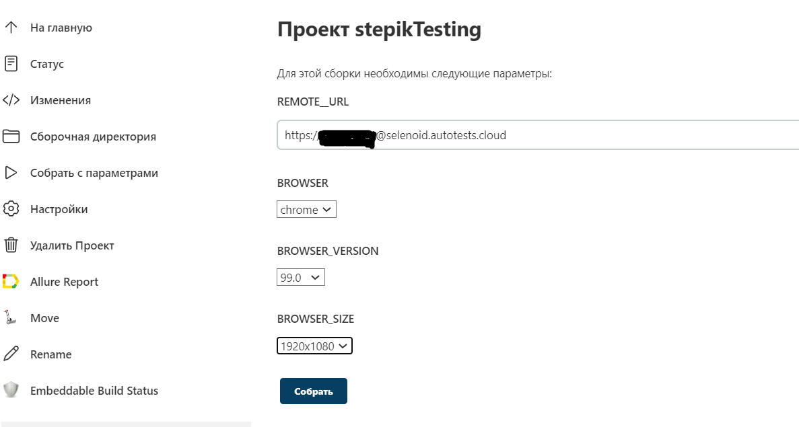
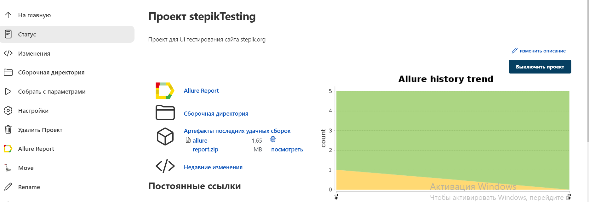
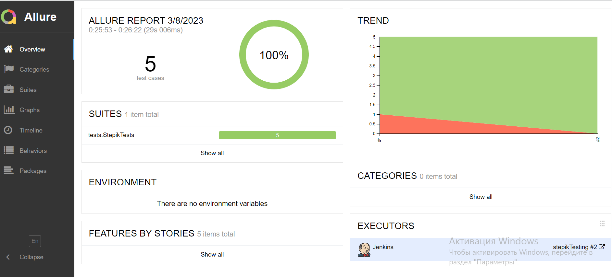
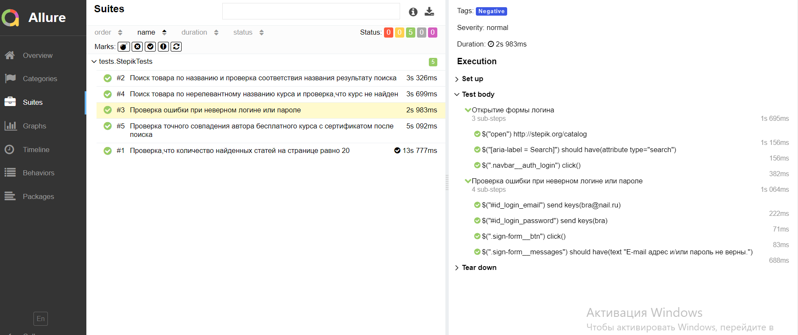
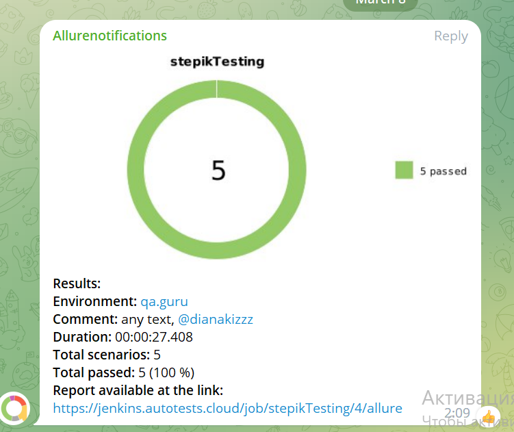

# Проект по UI тестам для сайта [Stepik.org](https://stepik.org/catalog)

<p align="center">

</p>

##  Содержание:

- [Технологии и инструменты](#technologist-технологии-и-инструменты)
- [Запуск тестов](#-запуск-тестов)
- [Запуск тестов в Jenkins](#-запуск-тестов-в-jenkins)
- [Отчет о результатах тестирования в Allure Report](#-отчет-о-результатах-тестирования-в-Allure-report)
- [Интеграция с Allure TestOps](#-интеграция-с-allure-testops)
- [Уведомления в Telegram](#-уведомления-в-telegram)
- [Пример запуска теста в Browserstack](#-пример-запуска-теста-в-Browserstack)

##  Технологии и инструменты

<p align="left">
<a href="https://selenide.org/"></a>
<a href="https://www.jetbrains.com/idea/"></a>
<a href="https://www.java.com/"></a>
<a href="https://gradle.org/"></a>
<a href="https://junit.org/junit5/"></a>
<a href="https://github.com/"></a>
<a href="https://github.com/allure-framework/allure2"></a>
<a href="https://qameta.io/"></a>
<a href="https://www.jenkins.io/"></a>
<a href="https://aerokube.com/selenoid/"></a>
<a href="https://web.telegram.org/"></a>
</p>

## Тест кейсы

- [x] Проверка релевантности поиска курса по слову
- [x] Поиск курса по нерелевантному названию курса и проверка,что курс не найден
- [x] Проверка,что количество найденных при поиске курсов на одной странице равно 20
- [x] Поиск курса с параметрами и проверка соответствия результата
- [x] Проверка текста ошибки при неверном логине или пароле

# Запуск тестов

Для локального запуска тестов:
```shell
gradle clean test -Denv=local 
```

Для удаленного запуска тестов:
```shell
gradle clean test -Denv=remote 
```

Получение отчёта:
```bash
allure serve build/allure-results
```

##  Запуск тестов в [Jenkins](https://jenkins.autotests.cloud/job/diploma_project_mobile/)

###Сборка проекта:
- Открыть <a target="_blank" href="https://jenkins.autotests.cloud/job/stepikTesting/">проект</a>

<p align="center">
  
</p>

- Выбрать пункт **Собрать с параметрами**

- В случае необходимости изменить параметры, выбрав значения из выпадающих списков

- Нажать **Собрать**

- Результат запуска сборки можно посмотреть в отчёте Allure
<p align="center">
  
</p>

##  Отчет о результатах тестирования в [Allure Report](https://jenkins.autotests.cloud/job/diploma_project_mobile/1/allure/)

<p align="center">
  
</p>

<p align="center">
  
</p>


##  Уведомления в Telegram
После завершения сборки специальный бот, созданный в <code>Telegram</code>, автоматически обрабатывает и отправляет сообщение с отчетом о прохождении тестов.

<p align="center">


## </a> Видео прохождения тестов

К каждому тесту в отчете прилагается видео.

<p align="center">
</a>
</p>

[Вернуться к началу ⬆](#Wikipedia)